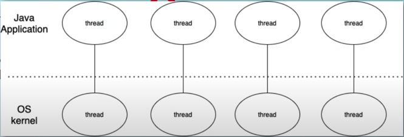

# booking-app

learning go

## Initial Commands

```gotemplate
go mod init <project_name>
```

This helps in initializing the `go` project.

What happens here?

- Initializes/generates `go.mod` file, this file
  - describes the module (Keep in mind that, the module path is also the **import path**)
  - also states the `go` version being used

In `go`, everything is organized into packages. And, there can be multiple files in a package.

Also, you need to define **entry point** of the application.

So the compiler knows where to start from among the multiple files that are present.

Keep in mind that as there can be only one entry point thus we can have **only one** `main` function.

If we plan on using any method/functionality, we need to ensure that we explicitly import the corresponding package.

So when we install go, we do get a set of standard packages which are themselves collections of source files.

Since they are installed by default as part of standard packages, we can directly start using them.

Which functionalities are present in which package?

- Read official documentation about the corresponding package or Google it.

- In MacOS, if you hover over the name of the package, and later, `cmd + click` on it in your IDE, it will
  
  - take you to the official documentation
  
  - also, open the package's source code available on your local machine

- With experience, you will get better at knowing the most popular packages and their functionalities/usages.

```gotemplate
go run <file_name>
```

This helps in compiling and running the `go` file. And it also compiles in any third-party libraries. So the standard/custom packages that are defined in `import` section are compiled as well.

While running multiple files under the same package, we need to ensure that all of them are defined in the run command. For example:

main (package)
├── main.go
└── helper.go

Here, the run command would look like `go run main.go helper.go`. It would be cumbersome to write the names of all files under the same package while running the go command, thus we can opt for `go run .`, which means running all the files in the current folder.

**Note:** To keep things simpler, always group files under the same package in the same folder.

What happens here?

- It looks for the `main` function and starts executing the lines underneath it one by one.

What else?

- We can also, define what is exportable in the package, by capitalizing the first letter of the corresponding variable, the function name. This is equivalent to defining public, protected or private.

- And thus, there are 3 levels of scope:

  scope
  ├── Local (declaration within function thus can be used within the function)
  ├── Package (declaration outside all functions thus can be used anywhere in the same package)
  └── Global (declaration outside all functions and capitalized first letter thus can be used everywhere across all packages)

**Note:** At the package level, you cannot use this colon equals syntax, you have to use the full declaration syntax.

**Note:** we can't redeclare a variable. So within the same scope, we can't initialize that variable twice, but we can continue to reassign values to it, but we can shadow them. So if we declare a variable in a package scope, for example, we can read declare that in a function scope, and that's going to shadow the variable at the higher level of scope.

**Note:** If you do plan on accessing variables in other packages, receiving them as an argument could be one of the best and simplest strategies. With this strategy, you might be able to access package-level variables across other packages (Usually this behavior is shown by global-level variables).

```gotemplate
go build <package_path>
```

Here if it finds a main package with a main function, then it's going to compile that as an executable. We can then go ahead and run that (using `./<executable_name>`).

```gotemplate
go install <package_path>
```

It is expected to be pointed to a package that has an entry point and it installs that package into your `bin` folder. By creating an executable and adding it to `bin` directory. 

**Note:** In case, we have a [standard directory structure](#directory-structure),and suppose we run the following command `go install github.com/amanjoshicodes/package_name` while being in `/code` directory, it would add the executable to `/code/bin` directory. Whereas, if the [standard directory structure](#directory-structure) is not followed and we still run the command, it would just add the executable to the `bin` directory of `GOPATH`.

`go` also ensures to maintain *better code quality* by throwing compilation errors if:

- we declare a variable or package and don't use it.

`const` which represents constants in `go` has the following characteristics:

- It has to be assignable at compile time. For example below code won't work:

  ```gotemplate
  // in order to determine the sine of that value, that actually requires the function to execute, which is not allowable at compile time.
  const myConst float64 = math.Sin(1.57)
  ```

- It allows implicit conversions for **untyped** constants:

  ```gotemplate
  // Type is not defined here
  const a = 16
  var b int16 = 27
  // works because compiler, when it sees constant it just replaces every instance. We're taking a literal 42, and adding an int 16 to it.
  fmt.Printf("%v, %T\n", a + b, a + b)
  ```

  **Note:** Above behavior is only possible with constants, trying out the above scenario with a variable would throw an error.

- It supports enumerated constants:
  
  ```gotemplate
  // Iota is a counter that we can use when we're creating enumerated constants. These are usually used at package level.
  // It's initial value is int 0
  const a = iota
  ```

  Read more about it [here][1]

Arrays in `go` have a **fixed size**. And, all the elements inside it need to be of the **same type**.

Since arrays in `go` have fixed sizes, we have a better option called `Slices` while dealing with a variable length which can be resized when needed.

`Slices` are abstractions of Arrays. They too are index based. But, are of variable length and can get sub-array of their own. Even here, all the elements need to be of the **same type**.

There is Map, and also slices of maps. The key-value pairs of maps need to be of the **same type**. For example, we cannot have keys as `string` and values as `int` in a map.

`go` also supports custom data structures that can be defined by the user.

`_` a.k.a. `Blank Identifier`. These are used to ignore variables. Thus are mainly used whenever we don't want to use a variable. Keep in mind that, in `go`, we have to explicitly call out unused variables.

By default, there is sequential code execution in `go`. Thus running the `main` goroutine, by default. But we can improve the efficiency of our code by making it concurrent. We can introduce concurrent behavior by adding the keyword `go` in front of the function. It starts a new goroutine. Keep in mind, `main` thread/goroutine **doesn't wait** for other concurrent functions to finish by default. Thus we also need synchronization between the goroutines, we can use `WaitGroup` under the `sync` package to provide us with basic synchronization functionality.

A little more about goroutine:

`goroutine` is a lightweight thread managed by go runtime.

Why are threads/goroutines in go are a better choice?

Unlike traditional `OS threads`, which are:

- expensive -> thus have a high startup time
  
- heavyweight -> needs more hardware resources

- managed by kernel and are hardware dependent

- there is no way of easy communication between threads

  

`go` has `green thread` which is:

- an abstraction of the actual thread

- managed by go runtime, thus we only interact with high level goroutines

- cheaper and lightweight

- where go has built-in functionality of channel to allow easy and safe communication between goroutines (They also help us handle concurrency issues when threads have shared data or are dependent on each other)

  

Thus, we can run millions of goroutines without affecting performance.

## Other stuff

```gotemplate
go list ... 
```

What happens here?

Executing the above command in any folder lists all the packages, including packages of the standard library first followed by external libraries in your go workspace.

```gotemplate
go install app
```

looks for `app` subdirectory inside `src` directory of `GOPATH` (since `GOROOT` doesn’t have it).

There is a set of programs to build and process Go source code. Instead of being run directly, programs in that set are
usually invoked by the go program. `GOPATH` and `GOROOT` are environment variables that define a certain arrangement and
organization for the Go source code. The paths of `GOPATH` and `GOROOT` can be modified explicitly if required.

```gotemplate
go env GOROOT
go env GOPATH
```

to check the current `GOROOT`, `GOPATH`.

`GOPATH`, also called the workspace directory, is the directory where the Go code belongs. It is implemented by and
documented in the go/build package and is used to resolve import statements. The `go get` tool downloads packages to the
first directory in `GOPATH`. If the environment variable is unset, `GOPATH` defaults to a subdirectory named “go” in the
user’s home directory.

```text
└── GOPATH
    ├── src     # holds source code. The path below this directory determines the import path or the executable name.
    ├── pkg     # holds installed package objects. Each target OS and architecture pair has its own subdirectory of pkg.
    └── bin     # holds compiled commands. Every command is named for its source directory.
```

**Note:** When using modules in Go, the `GOPATH` is no longer used to determine imports. However, it is still used to
store downloaded source code in the `pkg` and compiled commands `bin`.

`GOROOT` is for compilers and tools that come from go installation and is used to find the standard libraries. It should
always be set to the installation directory.

**Note:** It is possible to install the Go tools in a different location. This can be done by setting the `GOROOT`
environment variable to point to the directory in which it was installed, although this is not recommended as it comes
preset with the tooling.

Summary:

`GOPATH` is the path used where additional/custom packages' source code and binaries are downloaded and stored that are not part of standard packages (that are installed during installation of `go`)

`GOROOT` is the path where standard packages' source code and binaries are downloaded and stored during the installation of `go`. Thus if you plan on installing `go` at any other location other than the default i.e. `/usr/local/go`, you will have to update `GOROOT` to point toward that path.

**Note:** Suppose multiple paths are set in `GOPATH` variable, then `go get` would still install the packages in the first path that is defined in `GOPATH` but while searching for source code files of custom packages all the paths defined in `GOPATH` are looked for before downloading the package (again in the first path defined in `GOPATH`).

Some fine details:

`pkg` directory is where intermediate binaries are stored. They are mainly created so that they need not be re-compiled every time. So when we compile our `go` application, `go` checks if any of the source files in `pkg` directory have changed since the last time it compiled them. If it hasn't, then it's not going to recompile that package, it just goes ahead and links them into the binary it creates.

## Directory Structure

A general example of standard directory structure:

```shell
code
  ├── pkg 
  ├── bin 
  └── src
        └── github.com #Version control
              └── amanjoshicodes #Organization or User
                    └── package_name
                          └── go files 
```

[1]: https://www.gopherguides.com/articles/how-to-use-iota-in-golang
